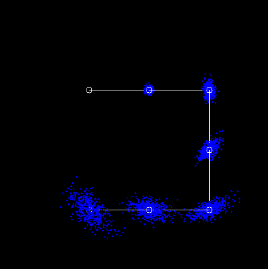

A C++ implementation of the sampled odometry motion model of a 2D robot based on contents in the Probabilistic Roboitcs by Sebastian Thrun et. al.

The package requires OpenCV as an external dependency.

Builing Package:

- clone the package

    ~$ git clone https://github.com/anli0726/Sample_Odometry_Motion_Model.git

- go to the root of the package, make the build directory, go into it, and cmake the file, then make file

    ~$ mkdir build
    ~$ cd build
    ~$ camke ..
    ~$ make

- execute the main function

    ~$ ./main

Demonstration of the result

